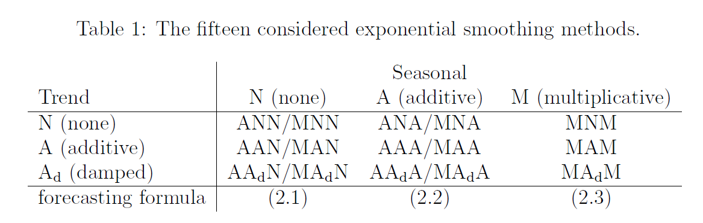
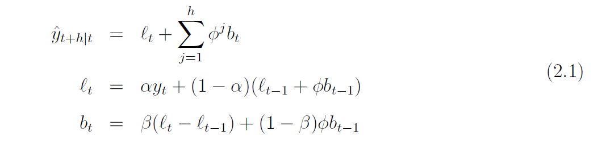
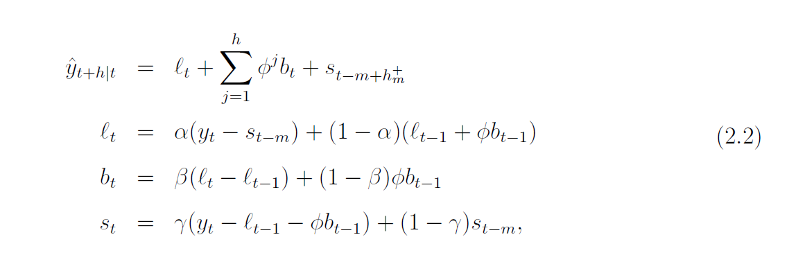
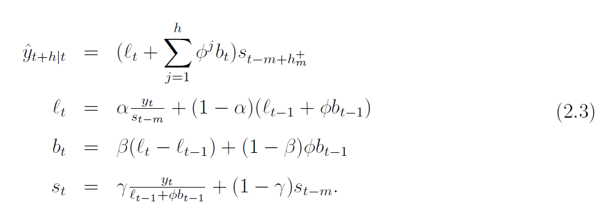

```{r}
library("tidyr")
library("ICSNP")
library("robustbase")
library("ggplot2")
library("dplyr")
library("robets")
```


```{r}
set.seed(seed = 13032022) #seed es la fecha
e <- rnorm(500,mean=0,sd=1)

alpha <- 0.5
beta <- 0.003
theta <- 0.9
m_1 <- 0
for(i in 2:length(e)){
  m_1[i] <- alpha+beta*i+theta*m_1[i-1]+e[i]
}
X_Y <- m_1
```


```{r}
data_cont <- c()
data_cont <- m_1
contamination <- c()
c_seq <- seq(0.1, 0.4, 0.1)
set.seed(seed = 13032022)
e <- rnorm(1,mean=0,sd=1)
for (i in c_seq) {
  alfa <- round(length(data_cont) * i)
  data_cont<-m_1
  for (j in seq(1, alfa, 1)){
    w = round(runif(1, 1, length(data_cont)))
    if (w %% 2 == 0) data_cont[w] <- data_cont[w]+e*1.5
    else data_cont[w]<- data_cont[w]-e*1.5
  }
  contamination <- cbind(contamination, data_cont)
}
colnames(contamination) <- c_seq
contamination <- cbind(contamination, seq(1, nrow(contamination)))
colnames(contamination)[ncol(contamination)] <- "X"
X_Y <- contamination[,4]
```

```{r}
m_a <- robets(X_Y, model="AAN")
m_a
```

```{r}
set.seed(seed = 13032022) #seed es la fecha
e <- rnorm(500,mean=0,sd=1)

alpha <- 0.5
beta <- 0.003
theta <- 0.9
m_1 <- 0
for(i in 2:length(e)){
  m_1[i] <- alpha+beta*i+theta*m_1[i-1]+e[i]
}
X_Y <- m_1

data_cont <- X_Y
c_seq <- seq(0.1, 0.4, 0.1)
set.seed(seed = 13032022)
e <- rnorm(1,mean=0,sd=1)
i <- 0.1
data_cont <- m_1
alfa <- round(length(data_cont) * i)
for (j in seq(1, alfa, 1)){
    w = round(runif(1, 1, length(data_cont)))
    if (w %% 2 == 0) data_cont[w] <- data_cont[w]+e*2
    else data_cont[w]<- data_cont[w]-e*2
}
plot(X_Y, type="l", col="red", lwd=2)
lines(data_cont, col="blue", lwd=2)
```


```{r}
sigmas <- m_a$states[2:nrow(m_a$states),1]
```


```{r}
library("robets")
m_ahenao <- robets(X_Y, model="AAN")
m_ahenao$roblik
```   

```{r}
l <- c(m_ahenao$roblik, m_ahenao$robaic, m_ahenao$robbic, m_ahenao$robaicc)
l <- rbind(l, l)
l
```

```{r}
a <- c("Huber", "Bisquare", "Hampel", "Welsh1", "Welsh2")
l <- c()
for (i in a){
  m_ahenao <- robets(X_Y, model = "AAN")
  l <- rbind(l, c(m_ahenao$roblik, m_ahenao$robaic, m_ahenao$robbic,
   m_ahenao$robaicc))
}
l
```

```{r}
a <- c("Huber", "Bisquare", "Hampel", "Welsh1", "Welsh2")
l <- list()
for (i in a){
  m_ahenao <- robets(X_Y, model = "AAN")
  l[[paste0(i)]] <- m_ahenao$robaicc
}
l
```

```{r}
l <- cbind(a, l)
l
```

```{r}
l <- rbind(c("psifun", "psifun", "lik", "aic", "bic", "aicc"), l)
l
```

```{r}
a <- c("Huber", "Bisquare", "Hampel", "Welsh1", "Welsh2")
l <- c()
m <- c()
for (i in a) {
  m_ahenao <- robets(X_Y, model = "AAN")
  l[[paste0(i)]] <- m_ahenao$robaicc
  m[[paste0(i)]] <- m_ahenao
}
# l <- cbind(a, l)
# l <- rbind(c("psifun", "lik", "aic", "bic", "aicc"), l)
print("SIMULATED DATA WITH ERROR BELONGS TO NORMAL(0, 1)")
print(which.min(l))
print(l)
```
```{r}
plot(m[[which.min(l)]])
```


```{r}
forecast.robets(m[[which.min(l)]], 20)
```


MODELS FOR TESTING

Variables for simulation:
T = 40
m = 4
sigma=0.05
alpha = 0.36
beta = 0.21
phi = 0.9
gamma = 0.2
l_0 = 1
b_0 = 0.05
s_ad = (-0.01, 0.01, 0.03, -0.03)
s_m = (0.99, 1.01, 1.03, 0.97)

Outliers then e is replaced e=e + u
u ~ N(0, K^2 * sigma^2)

e_t ~N(0, sigma^2)
e = 0.05 #Fraction of outliers
K = 20

Crevits shows three types of models:








```{r}
#Original
#values <- c(27, 27, 7, 24, 39, 40, 24, 45, 36, 37, 31, 47, 16, 24, 6, 21,
#35, 36, 21, 40, 32, 33, 27, 42, 14, 21, 5, 19, 31, 32, 19, 36,
#29, 29, 24, 42, 15, 24, 21)

y <- c(27, 27, 7, 24, 39, 40, 24, 45, 36, 37, 31, 47, 16, 24, 6, 21,
35, 36, 21, 40, 32, 33, 27, 42, 14, 21, 5, 19, 31, 32, 19, 36,
29, 29, 24, 42, 15, 24, 21, 35)

T <- 40
m <- 4
sigma <- 0.05
alpha <- 0.36
beta <- 0.21
phi <- 0.9
gamma <- 0.2
l_0 <- 1
b_0 <- 0.05
s_ad <- c(-0.01, 0.01, 0.03, -0.03)
s_m <- c(0.99, 1.01, 1.03, 0.97)

e <- 0.05 #Fraction of outliers
K <- 20

u <- rnorm(0, K^2 * sigma^2)
set.seed(17032022)
```

```{r}
#2.1
b_t <- c(b_0)
l_t <- c(l_0)
for (t in seq(2, T)) {
  e_t <- rnorm(1, mean= 0, sd = sigma^2)
  l_temp <- alpha * y[t] + (1 - alpha) * (l_t[t-1] + phi*b_t[t-1]) + alpha * e_t
  l_t <- c(l_t, l_temp)
  b_temp <- beta*(l_t[t] - l_t[t-1]) + (1- beta)* phi * b_t[t-1]
  b_t <- c(b_t, b_temp)
  y_pred <- l_t[t] + phi * b_t[t] + e_t
}
y_pred
```


```{r}
#5.1
b <- c(b_0)
l <- c(l_0)
y_c <- c()
e <- c(rnorm(1, mean= 0, sd = sigma^2))
for (t in seq(2, T)) {
  e <- c(e, rnorm(1, mean= 0, sd = sigma^2))
  l_t <- l[t-1] + alpha * e[t]
  l <- c(l, l_t)
  y_c <- c(y_c, l[t-1] + e[t])
}
y_c
```


